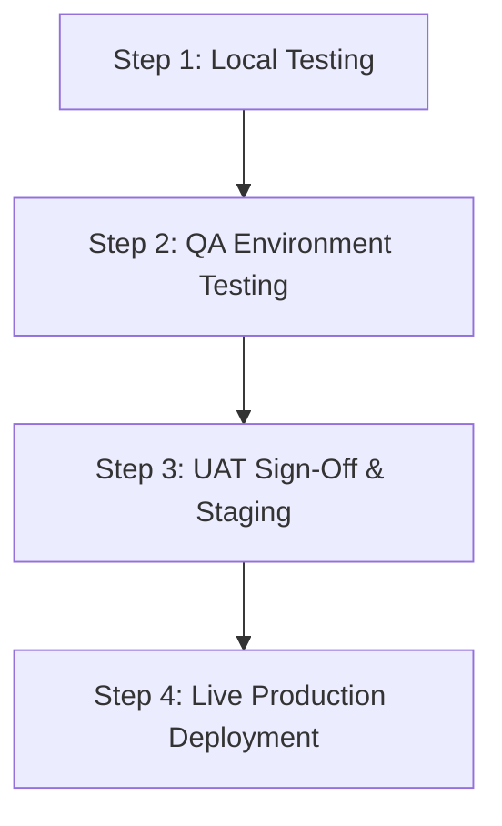

# PlanMyTrip — Backend API Specification & Readiness Guide
**Production, QA & UAT Staging Blueprint**

This document serves as the master contract between the **PlanMyTrip Frontend** and the **Backend Microservices**. It details every endpoint required by the frontend, the expected JSON schemas, what was previously missing in the backend, and step-by-step checklists to transition from **Local Testing → QA Testing → UAT Approval → Live Production**.

---

## 1. Architecture & Gateway Route Mapping

The frontend expects an **API Gateway** (or reverse proxy such as NGINX / Spring Cloud Gateway / Kong / AWS API Gateway) routed to the appropriate microservices:

| Service | Primary Gateway Path | Fallback Path | Description |
|---|---|---|---|
| **User & Auth Service** | `/api/user/**` | `/users/**` | Authentication, JWT issuing, user profiles, travel circle, persona |
| **Trip & Catalog Service** | `/api/trip/**` | `/trips/**` | Trip CRUD, status updates, destination catalog, preferences |
| **AI Itinerary Service** | `/api/trip/trips/:id/itinerary/**` & `/api/trip/itineraries/**` | `/trips/:id/itinerary/**` & `/itineraries/**` | AI plan generation, activity timeline, route stop optimization |
| **Wishlist Service** | `/api/trip/wishlist/**` | `/wishlist/**` | Saved destinations, suggestions |
| **Notification Service** | `/api/notification/**` | `/notifications/**` | In-app alerts, push/email channel preferences, newsletter leads |

> **Header Requirement for All Protected Endpoints:**
> ```http
> Authorization: Bearer <jwt_access_token>
> Content-Type: application/json
> ```

---

## 2. Standardized Response & Error Contracts

### Success Response Envelope (Recommended)
```json
{
  "success": true,
  "data": { ... }
}
```
*(Note: The frontend Axios interceptor automatically unwraps `response.data.data` or direct `response.data`).*

### Error Response Contract (Handled by Frontend)
```json
{
  "success": false,
  "status": 400,
  "error": "Bad Request",
  "message": "Friendly user-facing error message",
  "errors": [
    "Field 'destination' cannot be empty"
  ]
}
```

---

## 3. Detailed Endpoint Specifications

### A. User & Auth Service (`/api/user`)

#### 1. Register User
- **Method & Route:** `POST /api/user/auth/register`
- **Request Body:**
  ```json
  {
    "fullName": "Alex Smith",
    "email": "alex@example.com",
    "phone": "+91 98765 43210",
    "password": "Password123!",
    "confirmPassword": "Password123!"
  }
  ```
- **Response `(200 / 201)`:**
  ```json
  {
    "message": "Registration successful! Verification email sent."
  }
  ```

#### 2. Login
- **Method & Route:** `POST /api/user/auth/login`
- **Request Body:**
  ```json
  {
    "email": "alex@example.com",
    "password": "Password123!"
  }
  ```
- **Response `(200)` — Direct Token Return:**
  ```json
  {
    "token": "eyJhbGciOiJIUzI1NiIsIn...",
    "user": {
      "id": "usr_9812",
      "email": "alex@example.com",
      "fullName": "Alex Smith",
      "persona": "family"
    }
  }
  ```
  *(Or if backend requires 2FA OTP, return `{ "otpSent": true }` to prompt OTP entry).*

#### 3. Verify OTP
- **Method & Route:** `POST /api/user/auth/verify-otp`
- **Request Body:**
  ```json
  {
    "email": "alex@example.com",
    "otp": "492019"
  }
  ```
- **Response `(200)`:** Returns `{ "token": "...", "user": { ... } }`.

#### 4. Resend OTP
- **Method & Route:** `POST /api/user/auth/resend-otp`
- **Request Body:** `{ "email": "alex@example.com" }`

#### 5. Forgot Password
- **Method & Route:** `POST /api/user/auth/forgot-password`
- **Request Body:** `{ "email": "alex@example.com" }`

#### 6. Reset Password
- **Method & Route:** `POST /api/user/auth/reset-password`
- **Request Body:**
  ```json
  {
    "token": "reset_token_from_email",
    "newPassword": "NewPassword123!",
    "confirmPassword": "NewPassword123!"
  }
  ```

#### 7. Verify Email Token
- **Method & Route:** `GET /api/user/auth/verify-email?token=<token>`
- **Response `(200)`:** `{ "verified": true }`

#### 8. Current User Profile
- **Method & Route:** `GET /api/user/me` *(Protected)*
- **Response `(200)`:**
  ```json
  {
    "id": "usr_9812",
    "fullName": "Alex Smith",
    "email": "alex@example.com",
    "phone": "+91 98765 43210",
    "persona": "family"
  }
  ```

#### 9. Update Current User Profile
- **Method & Route:** `PUT /api/user/me` *(Protected)*
- **Request Body:** `{ "fullName": "Alex Smith", "email": "alex@example.com" }`

#### 10. Update Persona
- **Method & Route:** `PUT /api/user/persona` *(Protected)*
- **Request Body:** `{ "persona": "adventure" }`

#### 11. Travel Circle Members *(MISSING IN BACKEND)*
- **Get Circle:** `GET /api/user/travel-circle` *(Protected)*
  - Response: Array of members:
    ```json
    [
      {
        "id": "circ_01",
        "name": "Sarah Smith",
        "relationship": "Partner / Spouse",
        "email": "sarah@example.com",
        "initials": "SS"
      }
    ]
    ```
- **Add Member:** `POST /api/user/travel-circle` *(Protected)*
  - Body: `{ "name": "Leo Smith", "relationship": "Family Member", "email": "leo@example.com" }`
- **Remove Member:** `DELETE /api/user/travel-circle/:memberId` *(Protected)*

#### 12. User Stats
- **Method & Route:** `GET /api/user/stats` *(Protected)*
- **Response `(200)`:**
  ```json
  {
    "tripsPlanned": 4,
    "wishlisted": 9,
    "completed": 2
  }
  ```

#### 13. Feature Interest / Newsletter Subscription *(MISSING IN BACKEND)*
- **Method & Route:** `POST /api/user/newsletter/subscribe`
- **Request Body:**
  ```json
  {
    "email": "traveler@example.com",
    "category": "flights",
    "source": "coming_soon_flights"
  }
  ```

---

### B. Trip Service (`/api/trip`)

#### 1. List User Trips
- **Method & Route:** `GET /api/trip/trips?userId=<id>&status=<status>&page=0&size=20` *(Protected)*
- **Response `(200)`:** Array or Spring Page `{ "content": [ ... ] }` of trip objects:
  ```json
  [
    {
      "id": "trip_001",
      "name": "Kerala Family Getaway",
      "destination": "Kerala, India",
      "tripType": "family",
      "checkIn": "2026-11-10",
      "checkOut": "2026-11-15",
      "adults": 2,
      "children": 1,
      "budget": 120000,
      "currency": "INR",
      "status": "PLANNED"
    }
  ]
  ```

#### 2. Create Trip
- **Method & Route:** `POST /api/trip/trips` *(Protected)*
- **Request Body:**
  ```json
  {
    "userId": "usr_9812",
    "name": "Kyoto Autumn Tour",
    "destination": "Kyoto, Japan",
    "tripType": "couple",
    "checkIn": "2026-10-15",
    "checkOut": "2026-10-22",
    "adults": 2,
    "children": 0,
    "budget": 180000,
    "currency": "INR",
    "status": "PLANNED"
  }
  ```
- **Response `(201)`:** Returns created trip object containing `id`.

#### 3. Get Trip Details
- **Method & Route:** `GET /api/trip/trips/:tripId` *(Protected)*

#### 4. Update Trip Status
- **Method & Route:** `PATCH /api/trip/trips/:tripId/status` *(Protected)*
- **Request Body:** `{ "status": "COMPLETED" | "CANCELLED" | "PLANNED" | "DRAFT" }`

#### 5. Update Trip Preferences
- **Method & Route:** `PUT /api/trip/trips/:tripId/preferences` *(Protected)*
- **Request Body:**
  ```json
  {
    "budget": 150000,
    "currency": "INR",
    "estimatedCost": 142000
  }
  ```

#### 6. Update Trip Accommodation / Stay *(MISSING IN BACKEND)*
- **Method & Route:** `PUT /api/trip/trips/:tripId/stay` *(Protected)*
- **Request Body:**
  ```json
  {
    "name": "Grand Palace Hotel & Spa",
    "roomType": "Deluxe Sea View Suite",
    "rating": 4.8,
    "confirmationNumber": "HTL-92812",
    "reviews": 140
  }
  ```

#### 7. Trip Documents Management *(MISSING IN BACKEND)*
- **List Documents:** `GET /api/trip/trips/:tripId/documents` *(Protected)*
- **Upload Document:** `POST /api/trip/trips/:tripId/documents` *(Protected)*
  - Body:
    ```json
    {
      "title": "Flight Boarding Pass",
      "category": "Flight Ticket",
      "fileName": "boarding_pass.pdf",
      "fileSize": "240 KB",
      "dataUrl": "data:application/pdf;base64,...",
      "uploadedAt": "10/4/2026"
    }
    ```
- **Delete Document:** `DELETE /api/trip/trips/:tripId/documents/:documentId` *(Protected)*

#### 8. Popular Destinations Catalog
- **Method & Route:** `GET /api/trip/popular?persona=family&limit=6`
- **Response `(200)`:**
  ```json
  [
    {
      "id": "kerala",
      "name": "Kerala",
      "country": "India",
      "tag": "Backwaters & Nature",
      "rating": 4.9,
      "priceFrom": "₹18,500",
      "image": "https://..."
    }
  ]
  ```

---

### C. AI Itinerary Service (`/api/trip/trips/:tripId/itinerary`)

#### 1. Generate Itinerary for Existing Trip
- **Method & Route:** `POST /api/trip/trips/:tripId/itinerary/generate` *(Protected)*
- **Request Body:**
  ```json
  {
    "destination": "Kyoto, Japan",
    "checkIn": "2026-10-15",
    "checkOut": "2026-10-22",
    "budget": 180000,
    "adults": 2,
    "children": 0
  }
  ```
- **Response `(200)` Itinerary Schema:**
  ```json
  {
    "tripId": "trip_001",
    "destination": "Kyoto, Japan",
    "days": [
      {
        "id": "day-1",
        "index": 1,
        "dayNumber": 1,
        "label": "Arrival & Historic Gion",
        "dateLabel": "15 Oct 2026",
        "activities": [
          {
            "id": "act-1",
            "time": "10:00 AM",
            "title": "Arrive at Kyoto Station",
            "note": "Check in to accommodation and collect transport cards."
          },
          {
            "id": "act-2",
            "time": "02:30 PM",
            "title": "Explore Gion District",
            "note": "Stroll down Shirakawa canal and Hanami-koji street."
          }
        ]
      }
    ]
  }
  ```

#### 2. Get Saved Itinerary
- **Method & Route:** `GET /api/trip/trips/:tripId/itinerary` *(Protected)*
- **Response `(200)`:** Returns above Itinerary object or `404` if not generated yet.

#### 3. Persist Full Itinerary
- **Method & Route:** `PUT /api/trip/trips/:tripId/itinerary` *(Protected)*
- **Request Body:** Full updated itinerary object.

#### 4. Add Activity to Day
- **Method & Route:** `POST /api/trip/trips/:tripId/itinerary/days/:dayId/activities` *(Protected)*
- **Request Body:**
  ```json
  {
    "id": "day-1-1728000000",
    "time": "04:00 PM",
    "title": "Fushimi Inari Sunset Hike",
    "note": "Walk through thousands of vibrant torii gates."
  }
  ```

#### 5. Delete Activity
- **Method & Route:** `DELETE /api/trip/trips/:tripId/itinerary/days/:dayId/activities/:activityId` *(Protected)*

#### 6. Add Itinerary Day
- **Method & Route:** `POST /api/trip/trips/:tripId/itinerary/days` *(Protected)*
- **Request Body:**
  ```json
  {
    "id": "day-3-1728000000",
    "index": 3,
    "dayNumber": 3,
    "label": "New Day",
    "dateLabel": "Custom date",
    "activities": []
  }
  ```

#### 7. Update Trip Notes
- **Method & Route:** `PATCH /api/trip/trips/:tripId/notes` *(Protected)*
- **Request Body:** `{ "notes": "Pack rain jackets and power adapters." }`

#### 8. Optimize Route
- **Method & Route:** `POST /api/trip/trips/:tripId/route/optimize` *(Protected)*
- **Response `(200)`:** Reordered itinerary object minimizing transit distances.

---

### D. Wishlist Service (`/api/trip/wishlist`)

- **List Saved Destinations:** `GET /api/trip/wishlist` *(Protected)*
- **Save Destination:** `POST /api/trip/wishlist` *(Protected)*
  - Body:
    ```json
    {
      "destinationId": "kyoto",
      "name": "Kyoto",
      "country": "Japan",
      "category": "Culture",
      "image": "https://..."
    }
    ```
- **Remove Destination:** `DELETE /api/trip/wishlist/:itemId` *(Protected)*
- **AI Destination Suggestions:** `GET /api/trip/wishlist/suggestions?persona=family` *(Protected)*

---

### E. Notification Service (`/api/notification`)

- **Get Notifications Feed:** `GET /api/notification/notifications` *(Protected)*
  - Response:
    ```json
    [
      {
        "id": "notif_101",
        "title": "Weather Clearance Passed",
        "body": "Your upcoming trip to Kyoto has optimal conditions.",
        "unread": true,
        "createdAt": "2026-10-04T12:00:00Z"
      }
    ]
    ```
- **Mark All Read:** `PATCH /api/notification/read-all` *(Protected)*
- **Get Preferences:** `GET /api/notification/preferences` *(Protected)*
- **Update Preferences:** `PUT /api/notification/preferences` *(Protected)*
  - Body:
    ```json
    {
      "email": true,
      "push": true,
      "tripReminders": true
    }
    ```

---

## 4. Production Readiness Roadmap: Local → QA → UAT → Live



### Phase 1: Local Testing Checklist
- [x] Frontend builds with zero lint errors (`npm run lint` = 0 warnings, 0 errors).
- [x] Production build completes with zero errors (`npm run build`).
- [x] Local `.env` is configured with `VITE_API_BASE_URL=http://localhost:8080`.
- [x] Safe localStorage JSON parsing prevents White Screen of Death on corrupt storage.
- [x] 401 Unauthorized broadcasts force React auth state reset across all active tabs.

### Phase 2: QA Testing Checklist
- [ ] **Cross-Origin Resource Sharing (CORS):** Backend gateway allows `Access-Control-Allow-Origin: https://qa.planmytrip.com` with `Authorization` and `Content-Type` headers.
- [ ] **Token Expiry & Invalidation:** Verify that expiring JWT tokens trigger smooth redirect to `/login` without unhandled console errors.
- [ ] **Microservices Resilience:** Validate that when the AI Itinerary service is slow (>10s), the gateway timeout is configured (>=30s) and frontend displays loading state.
- [ ] **Input Sanitization:** Test special characters, emojis, and quotes in trip names, notes, and activity titles.
- [ ] **Network Failure Recovery:** Test creating trips or modifying itineraries in offline/poor connectivity; verify user-facing error banners render properly.

### Phase 3: UAT (User Acceptance Testing) Checklist
- [ ] **Persona Flow:** Sign up with each persona (Family, Couple, Solo, Friends, Adventure) and verify theme color tokens switch dynamically.
- [ ] **End-to-End Trip Lifecycle:**
  1. Register new account & verify email.
  2. Create trip from Home search bar.
  3. Generate day-by-day plan with AI.
  4. Add manual activities and customize notes.
  5. Upload a boarding pass / booking voucher in the Documents tab.
  6. Inspect real-time meteorological weather report and safety clearance modal.
  7. View map routing and verify GPS stops order.
  8. Save destination to Wishlist and remove it.
  9. Add travel circle companion in Profile.
  10. Update notification preferences and log out.

### Phase 4: Live Production Deployment Checklist
- [ ] Set `VITE_API_BASE_URL=https://api.planmytrip.com` in production deployment environment.
- [ ] Enable HTTPS / TLS 1.3 on both API gateway and CDN hosting the frontend.
- [ ] Enable Gzip / Brotli compression for assets (`.js`, `.css`, `.svg`).
- [ ] Configure Rate Limiting on public auth endpoints (`/api/user/auth/login`, `/api/user/auth/register`, `/api/user/auth/forgot-password`) to prevent brute force.
- [ ] Set up APM (Application Performance Monitoring) such as Datadog, Prometheus, or Sentry for real-time frontend and backend telemetry.
